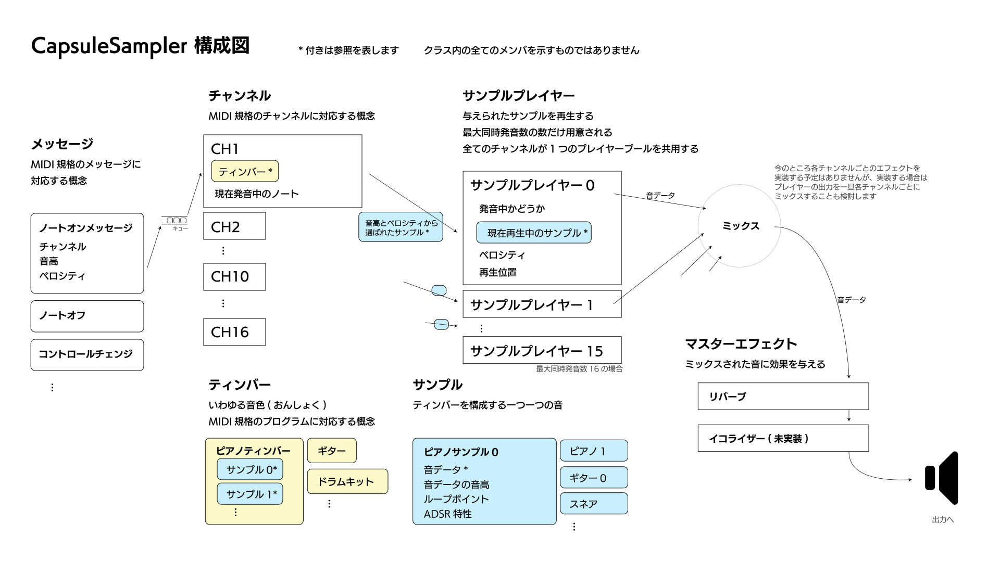

# CapsuleSampler

[English](README-en.md)

ESP32で動作するサンプラーライブラリ

サウンドデータを別途用意することでMIDI音源として使用できます。

## 構成図

## 音色を作成する

CapsuleSamplerを動作させるためには、音色を別途作成する必要があります。

### サウンドデータ

サウンドデータはint16_tの配列で、下記の条件を満たす必要があります。

* サンプルレート 48000Hz
* ワンショットの場合は、音データの後に1024サンプル程度の無音を確保する
* ループポイントを設定する場合は、ループポイントの後にループ区間と同じ波形を繰り返し配置し、1024サンプル程度の余白を確保する

### サンプル

サンプルは下記のメンバより構成される構造体です。

* サウンドデータ
* サウンドデータの長さ(サンプル数)
* サウンドデータを等倍で再生した時の音高
* ループ区間の開始サンプル (ADSR有効の場合にのみ使用されます)
* ループ区間の終了サンプル (ADSR有効の場合にのみ使用されます)
* ADSRが有効かどうか (falseの場合ワンショットとみなされます)
* アタック (0.0, 1.0]
* ディケイ (0.0, 1.0]
* サスティン [0.0, 1.0]
* リリース [0.0, 1.0]

#### ADSR特性について

処理の高速化のため、ADSR特性を使用する際にはミリ秒を使用せずに下記のように指定します。

##### アタック

64サンプルごとに音量にこの値が足されます。

例:

* 0.01 - アタック時間6400サンプル(133ms)と同等
* 1.0 - アタック時間0サンプル(0ms)と同等

##### ディケイ

64サンプルごとに音量がこの割合でサスティンに近づきます。

例:

* 0.999 - 音はゆっくりと減衰する
* 0.980 - 音は少し速く減衰する
* 0.900 - 音はかなり速く減衰する

##### サスティン

十分な時間ノートオンし続けた場合、音量は最終的にこの値になります。

例:

* 1.0 - 音は減衰しない
* 0.1 - 音の振幅は最終的にアタック直後の10%(-20dB)になる
* 0.0 - 音は最終的に無音になる

##### リリース

ノートオフ後、64サンプルごとに音量にこの値が掛けられます。

### ティンバー

1つ以上のサンプルを含んだティンバーを作成し、それを各チャンネルにセットすることで発音が可能になります。

ティンバーは下記のメンバより構成される構造体の配列です。

* サンプル
* ノートナンバーの下限(この数値自身を含む)
* ノートナンバーの上限(この数値自身を含む)
* ベロシティの下限(この数値自身を含む)
* ベロシティの上限(この数値自身を含む)

横軸をノートナンバー、縦軸をベロシティとした平面に長方形をプロットしていくイメージです。

配列は下記の制約を満たす必要があります。
* 任意の2つを取り出したとき、それらのノートナンバーの範囲が完全に一致しているか、全く重複していないかのどちらかである
* 同じlowerNoteNoを持つ任意の2つを取り出したとき、それらのベロシティの範囲が重複していない
* lowerNoteNoの低い順に並んでおり、同じlowerNoteNoを持つ項目はlowerVelocityの低い順に並んでいる
